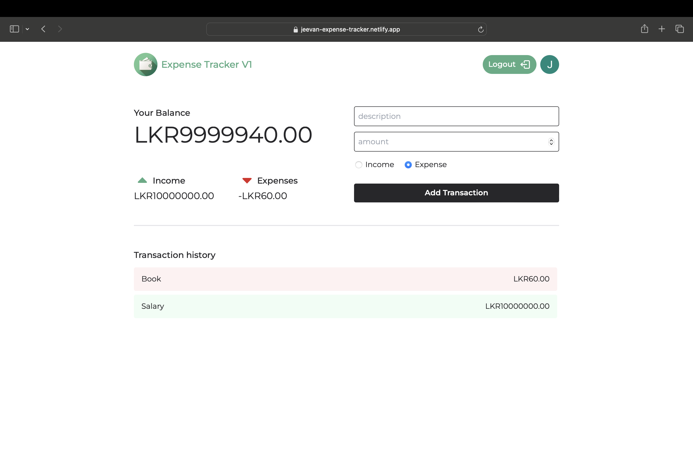

# Expense Tracker 

A modern, real-time expense tracking application built with React, Firebase, and Tailwind CSS. Track your income and expenses with a clean, responsive interface and secure Google authentication.


## 🚀 Live Demo

**[View Live Application](https://jeevan-expense-tracker.netlify.app)**

## ✨ Features

- 🔐 **Secure Authentication** - Google Sign-In integration
- 💰 **Transaction Management** - Add, view, and delete income/expenses
- 📊 **Real-time Updates** - Instant data synchronization across devices
- 🎨 **Modern UI** - Clean, responsive design with Tailwind CSS
- 🔥 **Firebase Backend** - Cloud Firestore for data storage
- 📱 **Fully Responsive** - Works seamlessly on all devices

## 📸 Screenshots

### Login Page

*Secure Google authentication for user access*

### Dashboard

*Track your balance, income, expenses, and transaction history*

## 🛠️ Tech Stack

- **Frontend:** React.js, Vite
- **Styling:** Tailwind CSS
- **Backend:** Firebase (Authentication & Firestore)
- **Routing:** React Router DOM
- **Deployment:** Netlify
- **State Management:** React Hooks (useState, useEffect)

## 📋 Prerequisites

Before you begin, ensure you have the following installed:

- [Node.js](https://nodejs.org/) (v14 or higher)
- [npm](https://www.npmjs.com/) or [yarn](https://yarnpkg.com/)
- A [Firebase](https://firebase.google.com/) account

## ⚙️ Installation & Setup

### 1. Clone the repository
```bash
git clone https://github.com/Jeevanm2004/expense-tracker.git
cd Expense-tracker-v1-main
```

### 2. Install dependencies
```bash
npm install
```

### 3. Set up Firebase

**Create a Firebase Project:**
- Go to [Firebase Console](https://console.firebase.google.com/)
- Click "Add project" or select an existing project
- Click the gear icon ⚙️ → "Project settings"
- Scroll down to "Your apps" section
- Click the web icon (`</>`) to register your app
- Copy the Firebase configuration object

**Enable Authentication:**
- In Firebase Console, go to "Authentication"
- Click "Get started"
- Enable "Google" sign-in method

**Create Firestore Database:**
- Go to "Firestore Database"
- Click "Create database"
- Start in "Test mode" (you can change security rules later)
- Choose your preferred location

### 4. Configure environment variables

Create a `.env` file in the root directory:

```env
VITE_API_KEY=your_api_key_here
VITE_AUTH_DOMAIN=your_project_id.firebaseapp.com
VITE_PROJECT_ID=your_project_id
VITE_STORAGE_BUCKET=your_project_id.appspot.com
VITE_MESSAGING_SENDER_ID=your_messaging_sender_id
VITE_APP_ID=your_app_id
VITE_MEASUREMENT_ID=your_measurement_id
```

Replace the values with your Firebase configuration from step 3.

### 5. Run the development server
```bash
npm run dev
```

### 6. Open your browser

Navigate to `http://localhost:5173`

## 🚀 Deployment

This project is deployed on Netlify. To deploy your own version:

### Deploy to Netlify

1. **Build the project:**
   ```bash
   npm run build
   ```

2. **Deploy via Netlify CLI:**
   ```bash
   npm install -g netlify-cli
   netlify login
   netlify deploy --prod --dir=dist
   ```

3. **Or deploy via Netlify Dashboard:**
   - Push your code to GitHub
   - Connect your repository to Netlify
   - Set build command: `npm run build`
   - Set publish directory: `dist`
   - Add environment variables in Netlify dashboard

4. **Add Environment Variables in Netlify:**
   - Go to Site settings → Environment variables
   - Add all your `VITE_*` variables from your `.env` file

5. **Update Firebase Authorized Domains:**
   - In Firebase Console → Authentication → Settings
   - Add your Netlify domain to "Authorized domains"

## 📁 Project Structure

```
expense-tracker/
├── public/
│   └── tab-logo.png
├── src/
│   ├── config/
│   │   └── firebase-config.js
│   ├── hooks/
│   │   ├── useAddTransaction.js
│   │   ├── useGetTransactions.js
│   │   └── useGetUserInfo.js
│   ├── pages/
│   │   ├── auth/
│   │   │   └── index.jsx
│   │   └── expense-tracker/
│   │       └── index.jsx
│   ├── App.jsx
│   ├── index.css
│   └── main.jsx
├── .env
├── .gitignore
├── index.html
├── package.json
├── tailwind.config.js
└── vite.config.js
```

## 🎯 Usage

1. **Sign In** - Click the "Google" button to sign in with your Google account
2. **View Balance** - See your current balance, total income, and total expenses
3. **Add Transaction** 
   - Enter a description
   - Enter the amount
   - Select transaction type (Income or Expense)
   - Click "Add Transaction"
4. **View History** - See all your transactions in the history section
5. **Delete Transaction** - Click the delete button (×) on any transaction to remove it
6. **Sign Out** - Click the "Logout" button in the top right

## 🔮 Future Enhancements

- [ ] Edit existing transactions
- [ ] Filter transactions by date range
- [ ] Sort transactions (by date, amount, type)
- [ ] Export transactions to CSV/PDF
- [ ] Budget setting and alerts
- [ ] Data visualization with charts and graphs
- [ ] Dark mode toggle
- [ ] Multiple currency support
- [ ] Category-based expense tracking
- [ ] Monthly/yearly spending reports

## 🤝 Contributing

Contributions are welcome! Please feel free to submit a Pull Request.

1. Fork the project
2. Create your feature branch (`git checkout -b feature/AmazingFeature`)
3. Commit your changes (`git commit -m 'Add some AmazingFeature'`)
4. Push to the branch (`git push origin feature/AmazingFeature`)
5. Open a Pull Request

## 📄 License

This project is licensed under the MIT License - see the [LICENSE](LICENSE) file for details.

## 👤 Author

**Jeevan M**

- GitHub: [@Jeevanm2004](https://github.com/Jeevanm2004)
- Portfolio: [jeevanm-portfolio.netlify.app](https://jeevanm-portfolio.netlify.app)
- LinkedIn: [linkedin.com/in/jeevanabhi](https://www.linkedin.com/in/jeevanabhi)
- Live Project: [jeevan-expense-tracker.netlify.app](https://jeevan-expense-tracker.netlify.app)

## 🙏 Acknowledgements

- [React Documentation](https://reactjs.org/)
- [Firebase Documentation](https://firebase.google.com/docs)
- [Tailwind CSS](https://tailwindcss.com/)
- [Vite](https://vitejs.dev/)
- [Netlify](https://www.netlify.com/)

---

⭐ Star this repository if you found it helpful!

**Built with ❤️ by Jeevan M**
